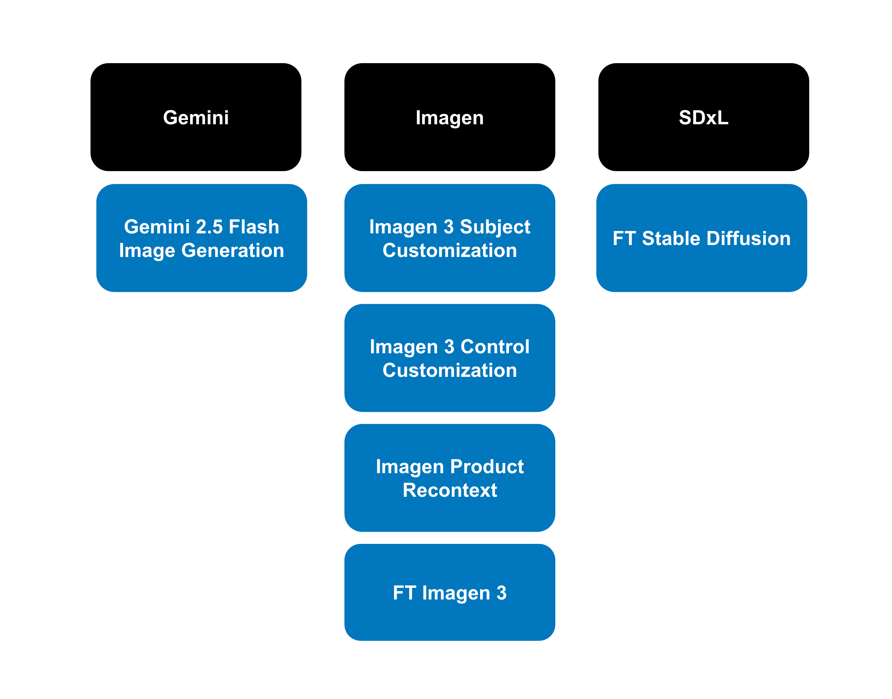
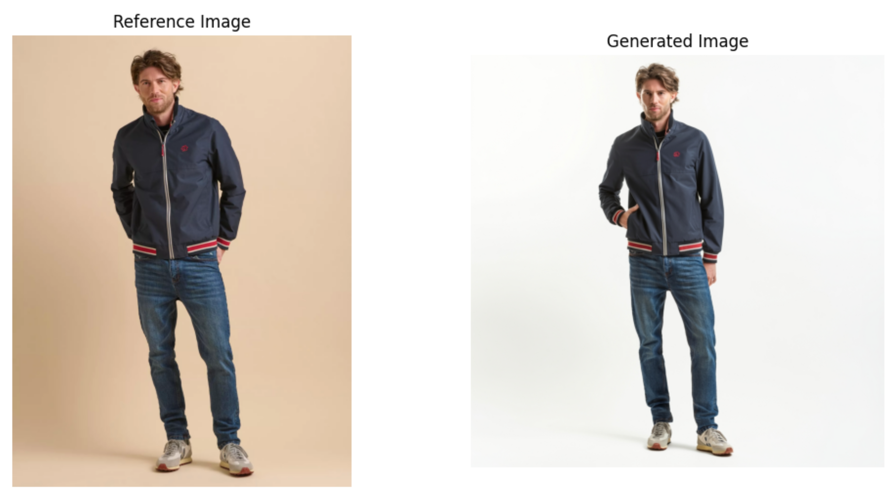
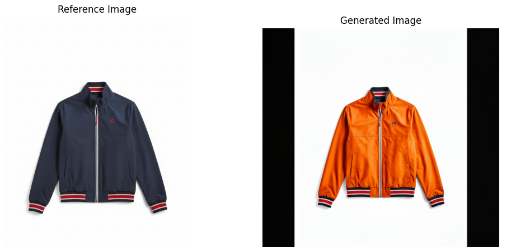
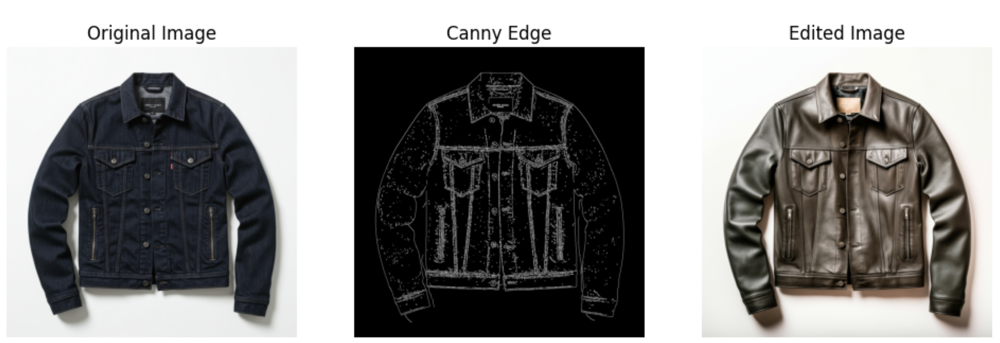
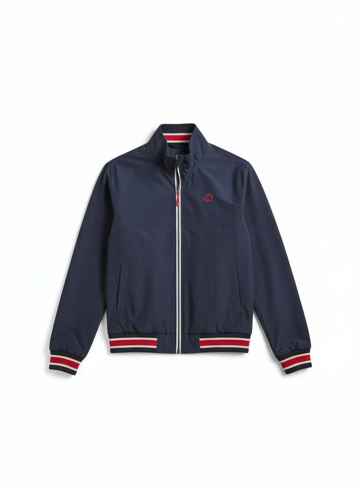
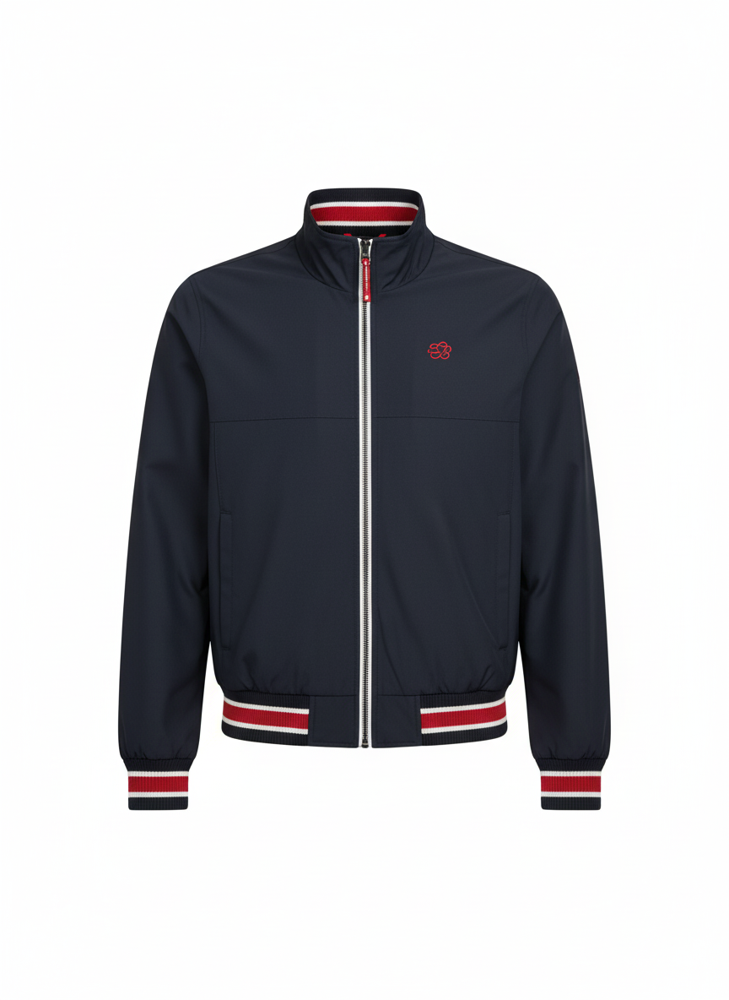

# Evaluating Products To Extract Product Image for Ecommerce

## Problem Space
How to extract product images from ecommerce pictures?

The ecommerce website has these 3 images for the men jacket. We want to extract just the jacket by providing these images to the model.

  
  
  

This is output image we want to acheive. A studio image of the jacket on the white background.

  

## Solutions Evaluated

  

1. Imagen 3 Subject Customization
2. Imagen 3 Control Customization
3. Imagen Product Recontext
4. Gemini 2.5 Flash Image Generation
5. Fine Tuning

## Key Results

### 1. Imagen 3 Subject Customization

- **Model name**: imagen-3.0-capability-001

- **Prompt**: "Create a flat lay product shot of the jacket[1] to match the description: An ecommerce product image of the jacket [1] against pure white background. The jacket is neatly laid flat, perfectly centered, zipped up, and facing directly forward in full shot. Use soft, diffused studio lighting to ensure even illumination across the entire garment, eliminating all shadows and highlighting the fabric texture and details without any creases or wrinkles. The entire jacket must be in sharp focus. Exclude any models, mannequins, hangers, or props."

- **Results**: The model was unable to extract the product. Particulary as stated in the documentation, the use case of the model is mainly for styling the subjects i.e changing the posture of the human or the color of the product.

  

- **Prompt**: "Generate the image of the jacket [1] but in orange color."

  

### 2. Imagen 3 Control Customization

- **Model name**: imagen-3.0-capability-001

- **Prompt**: "A photorealistic image along the lines of a leather jacket in a closet hanging on wooden hanger."

- **Results**: The model was unable to extract the product. It performs well in generating images that follows the outline of the canny image or scribble as shown in an example below. This can reduce hallucinations if combined well with fine tuned SDxL model.

  

### 3. Imagen Product Recontext

- **Model name**: imagen-product-recontext-preview-06-30

- **Prompt**: "A high-resolution product photograph of the jacket. The jacket should be laid flat, perfectly centered, and facing forward against a pure white background. The image needs soft, even studio lighting and a sharp focus on the entire garment. Exclude any models, mannequins, hangers, or props."

- **Results**: The model was able to extract the product after a few iterations of incorporating the following best practices:

    - State the camera setting (angle, lightning, photo type) and product orientation.
        - Output before stating the product orientation
             

              
            

        - After stating the product orientation
            

            
            

    - Understand the config parameters of the models
        - eg: turning *enhance_prompt=False* remove the unnecessary backgrounds

             

            
            

    - Provide Quality Reference Photos
        - Including the close up shot of the logo as one of the reference images improves the logo distortion in the output images

            

            
            

    - Generate more than one output image to choose the best quality

### 4. Gemini 2.5 Flash Image Generation

- **Model name**: gemini-2.5-flash-image-preview

- **Prompt**: "A high-resolution product photograph of the jacket. The jacket should be laid flat, perfectly centered, and facing forward against a pure white background. The image needs soft, even studio lighting and a sharp focus on the entire garment. Exclude any models, mannequins, hangers, or props."

- **Results**: The model was able to extract the product. The output quality is surprisingly good even though the model is multimodal and is not specifically trained for extracting product images. First output captures great details but the second output's logo is distorted.

    

      
      
    

### 5. Fine Tuning

- For product that needs adherence to the maximum details and brand uniformity, the following fine tuning steps can be performed:

    1. Render the 3d model of the product
    2. Perform object segmentation
    3. Generate canny edge image of the model to estimate product depth and edge
    4. Fine tune the base stable diffusion model by adapting model weights with Low Rank Adaptation (LoRA)
    5. Use the canny edge image and the fine tuned model to generate product in a different context

- As you can see, although this provide maximum quality output image, it is very labour intensive and time consuming. With ecommerce sites having thousands of products, fine tuning is not recommended.

## Conclusion

As of Aug 27th 2025, Imagen Product Recontext and the Gemini 2.5 Flash Image outputs come out neck to neck.

The output of the Imagen Product Recontext tends to pick up the details of the product better but seems to have more hallucination i.e having human body parts or picking up other product details like the undershirt.

Gemini 2.5 Flash Image Preview adheres better to the user provided prompt. However, sometimes it fails to pick up the details of the product i.e having logo distortion.

The other models are unable to extract the product successfully or too expensive.

For production use case, it is advisable to test with a few sample data and introduce human in the loop when testing Imagen Product Recontext or the Gemini 2.5 Flash Image.

## Further Research Needed

For production readiness, we will need an automated model output evaluation framework to scale this POC.