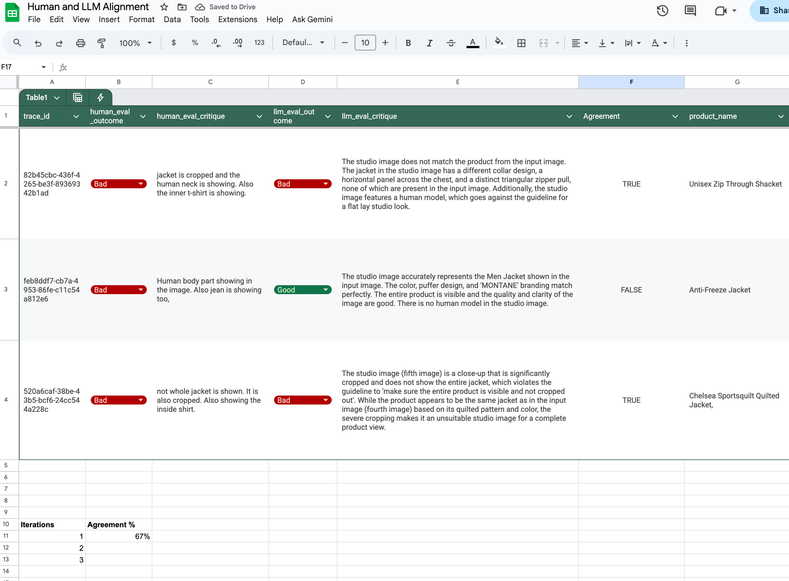

# Multimodal LLM Evaluation Framework

## Problem Space
The last mile to take LLM application from POC to production involves setting up robust LLM Evaluation Framework. Most AI Engineer will be familiar with observability tools like Langsmith and Langfuse. However, these tools alone is not enough. As of today Sept 3rd 2025, Langfuse image observablity is still in beta and the beta doesn't include custom image models. In addition, we need multilevels evaluation framework and not just tracing LLM calls.

## Solution
This repo references industry leading Eval thought leader, Hamel Husain iterative multisteps eval framework. More detailed explanation can be found in the blog post: [Your AI Product Needs Evals](https://hamel.dev/blog/posts/evals/).

For this MVP Evaluator, we are using the same case study of extracting flat lay product studio images from the ecommerce photos. A simple qualitative metric Good or Bad is used for simpler alignment between LLM as a judge and human evaluators. Good rating is given if the Imagen model correctly extracted the photo in correct branding, design, color, orientation, with no human body parts, and other props. Bad rating is given otherwise.

  

Credit: Slide from Dave Ebbelaar Gen AI Accelerator

## File Architecture

- **retail_image_processing_agent.py**: Main agent to extract flat lay studio product images from the ecommerce pictures.
- **human_image_evaluation.py**: Streamlit frontend where humans/domain experts evaluate the LLM generated images against the input images
- **llm_as_a_judge.py**: LLM as a Judge evaluating the same data.
- **product_recontext_events.json**: The temporary json file storing the event responses from the above three files. For production, this will be replaced by a database.
- **human_llm_alignment.csv**: CSV of the human evals and the llm as a judge evals and their alignment scores.
- **./data**: Folder containing all the test cases used to generate some sample data.

### Step 1: Creating Unit Test

Inside the *retail_image_processing_agent.py* a number of unit test cases are implemented. Ranging from checking input and output length to prompt injection.

These are just samples and more robust unit test will be added in coming days.

### Step 2: Creating Test Data

Ideally we want to have as many test data as time permits and allocate 10% of this to golden datasets. For this MVP, I have manually curated about 3 complete sets of test data and will be adding more.

### Step 3: Collecting Human Evals

Human Evals should come before testing with LLM as a Judge. The participating evaluator should be domain experts having skills to correctly evaluate if the generated output is good or bad. Having frontend like the Streamlit front end, *human_image_evaluation.py* will make this job easier. We need to look at these human evaluations and correct any errors that we can fix. These are low hanging fruits to solve before we move on to the next stage: LLM as a Judge.

  

### Step 4: Collecting LLM as a Judge Evals

The same data is then inserted into the LLM evaluator. Ideally this should be the most powerful thinking model that is specifically good at the job you are trying to evaluate. For the MVP, the first iteration is using Gemini 2.5 Flash but more testing to come with Gemini 2.5 Pro.

### Step 5: Aligning Human and LLM as a Judge

Then we would want the metrics from Human Evals and LLM Evals to align as closely as possible. You can use a simple sheet to compare the alignment. See *human_llm_alignment.csv* sample sheet file with actual test data. You would want to conduct multiple iterations to the threshold where you are comfortable.

  

### Step 6: A/B Testing

Once all the unit tests are implemented, low hanging fruits from human evals are corrected, and the human llm alignment is either 100% or at a good threshold, you can now conduct A/B Testing with actual users. This is out of scope for this MVP.

