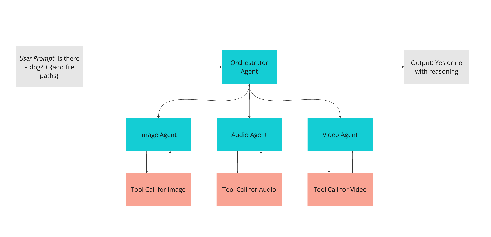

# Building Multimodal MultiAgents Framework Using Langraph and Gemini 2.0 Flash

The project uses Langchain, Langraph and Gemini 2.0 Flash model to identify objects from image, audio and video files. Potential use cases include but not limited to: content moderation, object identification, and multimedia search and retrieval.

## The MultiAgents Architecture



### The Workflow:

1. User asks the agent to verify if a specific object exists in the provided files.
2. The Orchestrator Agent will call relevant worker agents: image_agent, audio_agent, and video_agent while passing the user question and the relevant files.
3. Each worker agent will call respective tooling to convert the provided file to base64 encoding.
4. The final finding of each agent is then passed back to the Orchestrator Agent.
5. The Orchestator Agent then synthesized the findings and made the final conclusion.

## Potential Usecases

The framework is ideal for use cases where you need to ask the agent to reason and make a decision or generate conclusions from different sources.

Example use cases:

- **content moderation**: verifying if the image contain a specific logo or an audio containing copyrighted music
- **object identification**: using different sources of data to verify if an object exist on a map or at a certain time
- **multimedia search and retrieval**: finding files that contains an object

## Running Locally

To run the agent locally, follow the steps below:


1. Clone this repository and cd into **multiagents_framework** folder.
2. If you are using conda create new environment using:
    ```bash
    conda create -n env-name python=3.11
    ```
    If not, make sure your python environment is > 3.10. Note: This project was built using Python v3.11.11.
3. Install necessary packages
    ```python
    pip install -r requirements.txt
4. Replace .env.example with actual .env file
5. Update the API keys in the .env file
6. Get Google API key to use langchain-google-vertexai by following this:
   <a href="https://python.langchain.com/docs/integrations/chat/google_vertex_ai_palm/" target="_blank">link</a>
7. Get Langsmith API key by following this:
   <a href="https://docs.smith.langchain.com/observability" target="_blank">link</a>


## Sample Tests

#### Positive Dog Result

Test Code:

```python
# Positive dog result
config = {"configurable": {"thread_id": "1"}, "subgraph": True}
messages = react_graph_memory.invoke(
    {"messages": [HumanMessage(content=[
            {"type": "text", "text": "Question: Can you see dog in these files? Explain your reasoning. File path: For image_agent, use the image path ./data/dog_yes.jpg. For audio_agent, use the audio file path ./data/dog_audio_yes.mp3. For video_agent, use the video file path ./data/dog_video_yes.mp4"}
        ])]}, config
)

for m in messages['messages']:
    m.pretty_print()
```

Result:

```bash
================================ Human Message =================================

[{'type': 'text', 'text': 'Question: Can you see dog in these files? Explain your reasoning. File path: For image_agent, use the image path ./data/dog_yes.jpg. For audio_agent, use the audio file path ./data/dog_audio_yes.mp3. For video_agent, use the video file path ./data/dog_video_yes.mp4'}]
================================== Ai Message ==================================
Name: image_agent

Yes, there is a dog in the image. The image contains a small, fluffy dog with a white and gray coat. It is sticking out its tongue and wearing a collar with a tag.
================================== Ai Message ==================================
Name: audio_agent

I can hear a dog barking in the audio file.
================================== Ai Message ==================================
Name: video_agent

Okay, I have analyzed the video, and the result is: Yes, there are multiple dogs in this video.
================================== Ai Message ==================================

Based on all three agents, the final answer is yes, there is definitely a dog in the provided files. The image agent visually confirms a dog, the audio agent detects dog barking, and the video agent identifies multiple dogs.
```

#### Negative Dog Result

Test Code:

```python
# Negative Dog Result
config = {"configurable": {"thread_id": "2"}, "subgraph": True}
messages = react_graph_memory.invoke(
    {"messages": [HumanMessage(content=[
             {"type": "text", "text": "Question: Can you see dog in these files? Explain your reasoning. For image_agent, use the image path ./data/scenery.jpg. For audio_agent, use the audio file path ./data/girl_laughing.mp3. For video_agent, use the video file path ./data/people_thinking.mp4"}
        ])]}, config
)

for m in messages['messages']:
    m.pretty_print()
```

Result:

```bash
================================ Human Message =================================

[{'type': 'text', 'text': 'Question: Can you see dog in these files? Explain your reasoning. For image_agent, use the image path ./data/scenery.jpg. For audio_agent, use the audio file path ./data/crowd_cheering.mp3. For video_agent, use the video file path ./data/people_thinking.mp4'}]
================================== Ai Message ==================================
Name: image_agent

The `load_image` function's response indicates that there is no dog in the image. The image shows a landscape with a grassy hill, a tree, a bright blue sky with clouds, and some red flowers.
================================== Ai Message ==================================
Name: audio_agent

The audio file contains human cheering sounds. I cannot confirm the presence of a dog in the audio file.
================================== Ai Message ==================================
Name: video_agent

I have analyzed the video using the `load_video` tool. The response indicates that there is no dog in the video. The video features people expressing thought or concern, but no animals are present.
================================== Ai Message ==================================

The agents agree that there is no dog in the provided files.
FINAL DECISION: There is no dog in the files.
```

For questions or further collaboration, you can reach out to me here:
<a href="https://www.mayshinlyan.com/" target="_blank">link</a>
